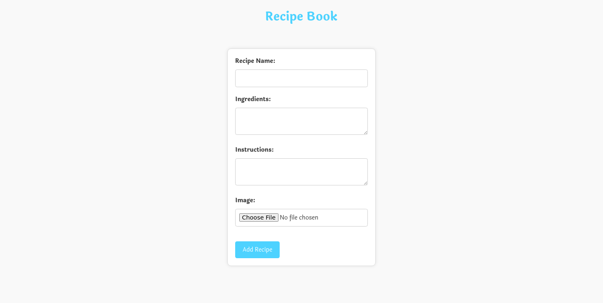
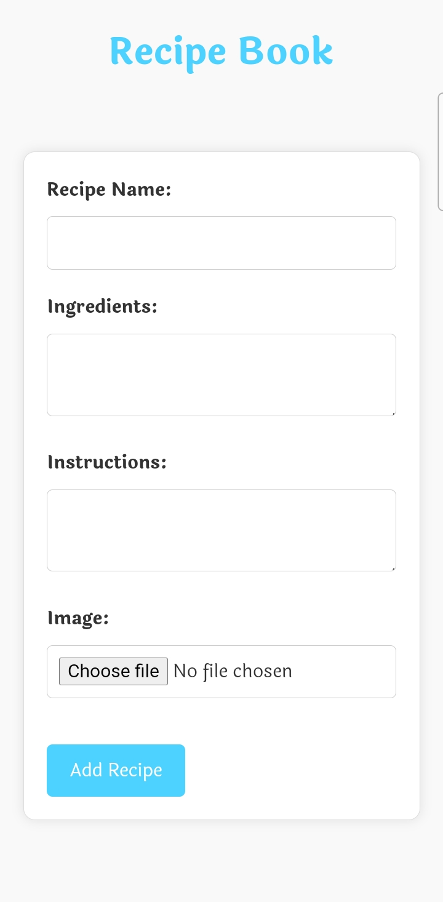

# CodeClauseInternship_Recipe-Book
Web app for storing and displaying recipes using HTML, CSS, JavaScript, Local Storage

# 🍲 Recipe Book Web App

A simple and intuitive web application for managing your favorite recipes. This app allows users to add, edit, and delete recipes, as well as view a gallery of all stored recipes. Each recipe can include a name, ingredients, instructions, and an image.

## ✨ Features

- **➕ Add Recipe:** Fill in the form with the recipe's name, ingredients, instructions, and an image to add a new recipe to your collection.
- **✏️ Edit Recipe:** Modify any existing recipe by editing the fields you want to change. Leave other fields empty to retain their current values.
- **🗑️ Delete Recipe:** Remove any recipe from your collection with a single click.
- **📖 View Recipes:** Browse all your recipes in a visually appealing gallery format.

## 🛠️ Technologies Used

- HTML
- CSS
- JavaScript
- Local Storage (for persisting data)


## 🚀 Setup

1. Clone the repository to your local machine:
    ```sh
    git clone https://github.com/SachinX01/Recipe-Book-Webapp.git
    ```

2. Navigate to the project directory:
    ```sh
    cd Recipe-Book-Webapp
    ```

3. Open `index.html` in your favorite web browser to use the app.

## 📋 Usage

### ➕ Adding a Recipe

1. Fill in the "Recipe Name", "Ingredients", "Instructions", and upload an image in the "Add Recipe" form.
2. Click "Add Recipe" to save the new recipe to your collection.

### ✏️ Editing a Recipe

1. Click the "Edit" button on the recipe card you want to modify.
2. In the edit modal, update the fields you want to change and leave others empty to retain their current values.
3. Click "Save Changes" to update the recipe.

### 🗑️ Deleting a Recipe

1. Click the "Delete" button on the recipe card you want to remove.
2. Confirm the deletion in the prompt.

### 📖 Viewing Recipes 

- All saved recipes are displayed in the gallery. Each recipe card shows the name, image, ingredients, and instructions.

## 📷 Screenshots





## 📄 License

This project is licensed under the MIT License.

## 📧 Contact

For any inquiries, please contact [sachinkumarnishad321@gmail.com](mailto:sachinkumarnishad321@gmail.com).

---
